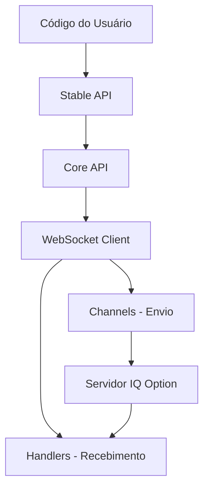

# Architecture

> Auto-generated by /map on 2026-04-22

## Overview

O sistema é um invólucro (wrapper) para a API da corretora IQ Option, focado em comunicação via WebSocket para negociação em tempo real. Ele utiliza uma arquitetura baseada em canais de envio e manipuladores de resposta para gerenciar a complexidade do protocolo binário/JSON da corretora.

## Components

### Stable API
- **Purpose:** Interface de alto nível para operações comuns (compra, histórico, saldo).
- **Location:** `iqoptionapi/stable_api.py`
- **Dependencies:** `api.py`, `constants.py`

### Core API
- **Purpose:** Gerencia autenticação, URLs de conexão e instância do WebSocket.
- **Location:** `iqoptionapi/api.py`
- **Dependencies:** `requests`, `ws/client.py`

### WebSocket Client
- **Purpose:** Gerencia o ciclo de vida da conexão WebSocket (on_open, on_message, on_error).
- **Location:** `iqoptionapi/ws/client.py`
- **Dependencies:** `websocket-client`

### Channels (Envio)
- **Purpose:** Módulos individuais para cada tipo de comando enviado à corretora.
- **Location:** `iqoptionapi/ws/chanels/`
- **Examples:** `buyv3.py`, `candles.py`, `ssid.py`

### Handlers (Recebimento)
- **Purpose:** Módulos que processam as respostas específicas vindas do servidor.
- **Location:** `iqoptionapi/ws/received/`
- **Examples:** `balances.py`, `order.py`, `position_changed.py`

## Data Flow

1. **Inicialização:** O usuário instancia `IQOption` em `stable_api.py`.
2. **Conexão:** A `api.py` configura o `WSClient` com a URL e credenciais.
3. **Comando:** Uma chamada de função (ex: `buy`) seleciona um `Channel` para enviar o JSON via WebSocket.
4. **Resposta:** O `WSClient` recebe a mensagem, identifica o tipo e delega para o `Handler` correspondente.
5. **Estado:** O `Handler` atualiza o estado interno na instância da API que o usuário consulta.

## Integration Points

| Service | Type | Purpose |
|---------|------|---------|
| IQ Option | WebSocket (WSS) | Negociação e dados em tempo real |
| IQ Option | HTTPS | Autenticação e download de dados estáticos |

## Technical Debt

- [ ] **Versão da API:** O código reporta "7.1.3", mas o usuário indica estar desatualizado.
- [ ] **Protocolo WebSocket:** Possível dessincronização entre os `Channels`/`Handlers` e o protocolo atual da corretora.
- [ ] **URLs Hardcoded:** URLs de conexão estão fixas no código, dificultando mudanças de região ou endpoint.
- [ ] **Dependência Externa:** Uso da biblioteca `websocket-client` que pode exigir atualizações de segurança ou performance.
